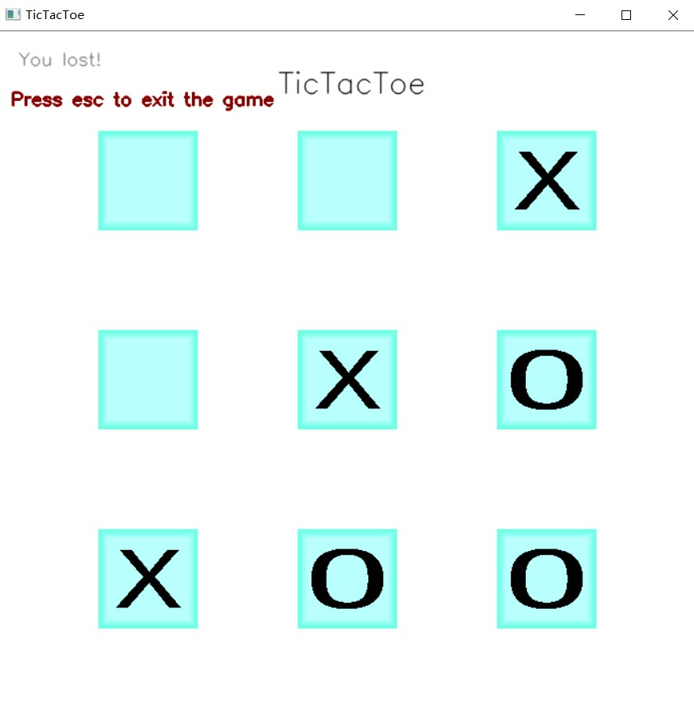

# 基于opencv、C++实现的井字棋小程序

***

本程序实现了一个简单的***井字棋程序***，可以与电脑进行对局。

* 编译运行需要cvui.h、main.cpp文件和data中的图片

* 本程序使用了opencv库和一个基于opencv的轻量级图形化界面库[cvui: A (very) simple UI lib built on top of OpenCV drawing primitives (github.com)](https://github.com/Dovyski/cvui)

* 运行示例：

    

    

	
	
	